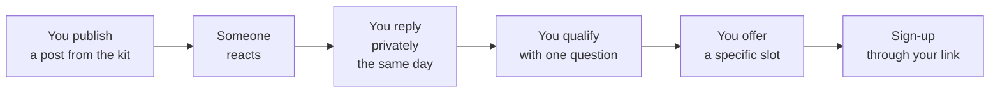

<Info>
  **English review version.** This kit ships to French agents, in French. It has been translated to English for approval only. The French original is preserved on the `main` branch and in merged PR #1, and must be restored before the link goes to any agent. The copy blocks are what agents paste, so in English they are illustrative, not usable.
</Info>

  
Ambassador kit · v2

  
Your network trusts you. This kit exists so you don't spend that trust badly.

  
Ready-to-paste posts, two emails, six visuals, and one simple rule: you stay at the centre, CYRUSS stays the tool.

This kit does one thing: it makes you credible to your own network. You are not advertising CYRUSS. You are showing that you secure your rentals and protect your clients.

<Info>
  **Ten minutes is enough to start.** Read the three golden rules, pick one post, publish it. The rest of the kit is here when you need it.
</Info>

## The 3 golden rules

<Steps>
  <Step title="This kit puts you forward, not CYRUSS" icon="user-check">
    CYRUSS is the tool that makes you credible, not the star of the post. You are showing your network that you are a professional working at the sharp end.
  </Step>
  <Step title="Stay honest" icon="shield-check">
    You publish under your own name, so it is your reputation. What we put forward: verified tenant files, the business network, the founder rate, plus time saved and confidence gained.

    What we never promise: software that does everything (features roll out in waves), a rate "locked for life", or a "limited cohort". See [Usage guide](/guide).
  </Step>
  <Step title="Every share carries a trackable link" icon="link">
    Use your personal link so your referrals and your Club commissions are properly credited to you.
  </Step>
</Steps>

## Your personal link

<Warning>
  **Referral codes are not live yet.** Do not publish your link. It would send your network to a page that does not exist. This block will be completed before the kit is distributed.
</Warning>

<CardGroup cols={2}>
  <Card title="Your link" icon="link">
    cyruss.ai/\[YOUR-CODE\]
  </Card>

  <Card title="Your referral code" icon="hash">
    \[TO BE COMPLETED\]
  </Card>
</CardGroup>

Every agent gets a code. Any sign-up through your link is credited to you.

## Two goals, two angles

<Tabs>
  <Tab title="Attract clients">
    **You are talking to** your general audience: landlords and tenants.

    **Your angle:** "Here is how I secure my rentals."

    <Check>
      Formal register for landlords. Informal for tenants on Instagram and WhatsApp.
    </Check>
  </Tab>

  <Tab title="Recruit fellow agents">
    **You are talking to** other estate agents, for the Business Club.

    **Your angle:** "Files arrive already verified, so I get back to the advisory work."

    <Check>
      Formal register, always. A fellow agent is not a mate, even once they become one.
    </Check>
  </Tab>
</Tabs>

## How it actually plays out

<Tip>
  The step most often lost is the third. A reply tomorrow is worth half a reply within the hour.
</Tip>

## Where to start

<CardGroup cols={2}>
  <Card title="Ready-to-paste posts" icon="pen-line" href="/textes">
    LinkedIn, Instagram, Facebook, WhatsApp. Several variants per channel.
  </Card>

  <Card title="Ready-to-send emails" icon="mail" href="/mails">
    One landlord email, one fellow-agent email, subject lines and variants included.
  </Card>

  <Card title="Visuals" icon="image" href="/visuels">
    Six visuals to produce, with the full brief for each.
  </Card>

  <Card title="Example posts" icon="layout-grid" href="/exemples">
    What it looks like once published, channel by channel.
  </Card>

  <Card title="CYRUSS brand charter" icon="palette" href="/charte">
    Colours, typeface, logo. To apply to everything you produce.
  </Card>

  <Card title="Usage guide" icon="compass" href="/guide">
    Register, when to publish, and what you must never write.
  </Card>
</CardGroup>

<Note>
  A question that comes up often: "can I edit the posts?" Yes, and you should. Copy pasted at 100% is obvious. See [Questions you'll be asked](/faq).
</Note>
