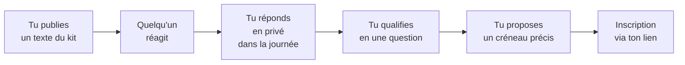

  
Kit ambassadeur · v2

  
Ton réseau te fait confiance. Ce kit sert à ne pas gâcher ça.

  
Des textes prêts à coller, deux mails, six visuels et une règle simple : tu restes au centre, CYRUSS reste l'outil.

Ce kit sert à une chose : te rendre crédible auprès de ton réseau. Tu ne fais pas la publicité de CYRUSS, tu montres que tu sécurises tes locations et que tu protèges tes clients.

<Info>
  **Dix minutes suffisent pour commencer.** Lis les trois règles d'or, choisis un texte, publie. Le reste du kit t'attend quand tu en auras besoin.
</Info>

## Les 3 règles d'or

<Steps>
  <Step title="Ce kit te met en valeur, toi" icon="user-check">
    CYRUSS est l'outil qui te rend crédible, pas la vedette. Tu montres à ton réseau que tu es un pro à la pointe.
  </Step>
  <Step title="Reste honnête" icon="shield-check">
    Tu publies à ton nom, c'est ta réputation. On met en avant les **dossiers locataires vérifiés**, le **réseau d'affaires** et le **tarif fondateur**, plus le gain de temps et le gain de confiance.

    Ce qu'on ne promet jamais : un logiciel qui fait tout (les fonctions se déploient par vagues), un tarif « bloqué à vie », ou une « cohorte limitée ». Voir [Guide d'usage](/guide).
  </Step>
  <Step title="Chaque partage a un lien traçable" icon="link">
    Utilise ton lien personnel pour que tes filleuls et tes commissions du Club soient bien comptés.
  </Step>
</Steps>

## Ton lien personnel

<Warning>
  **Les codes parrain ne sont pas encore actifs.** Ne publie pas encore ton lien : il renverrait ton réseau vers une page qui n'existe pas. Ce bloc sera complété avant la diffusion du kit.
</Warning>

<CardGroup cols={2}>
  <Card title="Ton lien" icon="link">
    cyruss.ai/\[TON-CODE\]
  </Card>

  <Card title="Ton code parrain" icon="hash">
    \[À COMPLÉTER\]
  </Card>
</CardGroup>

Chaque agent reçoit son code. Toute inscription via ton lien t'est rattachée.

## Deux objectifs, deux angles

<Tabs>
  <Tab title="Attirer des clients">
    **Tu parles à** ton audience grand public : propriétaires et locataires.

    **Ton angle :** « Voilà comment je sécurise mes locations. »

    <Check>
      Vouvoiement pour les propriétaires. Tutoiement pour les locataires sur Instagram et WhatsApp.
    </Check>
  </Tab>
  <Tab title="Recruter des confrères">
    **Tu parles à** d'autres agents immobiliers, pour le Club d'Affaires.

    **Ton angle :** « Les dossiers arrivent vérifiés, je reprends mon métier de conseil. »

    <Check>
      Vouvoiement, toujours. Un confrère n'est pas un copain, même quand il le devient.
    </Check>
  </Tab>
</Tabs>

## Comment ça se passe, concrètement

<Tip>
  L'étape qui se perd le plus souvent est la troisième. Une réponse le lendemain vaut la moitié d'une réponse dans l'heure.
</Tip>

## Par où commencer

<CardGroup cols={2}>
  <Card title="Textes prêts à coller" icon="pen-line" href="/textes">
    LinkedIn, Instagram, Facebook, WhatsApp. Plusieurs variantes par canal.
  </Card>

  <Card title="Mails prêts à envoyer" icon="mail" href="/mails">
    Un mail propriétaire, un mail confrère, objets et variantes inclus.
  </Card>

  <Card title="Visuels" icon="image" href="/visuels">
    Six visuels à produire, avec le brief complet de chacun.
  </Card>

  <Card title="Exemples de posts" icon="layout-grid" href="/exemples">
    À quoi ça ressemble une fois publié, canal par canal.
  </Card>

  <Card title="Charte CYRUSS" icon="palette" href="/charte">
    Couleurs, police, logo. À appliquer sur tout ce que tu produis.
  </Card>

  <Card title="Guide d'usage" icon="compass" href="/guide">
    Tu ou vous, quand publier, et ce qu'il ne faut jamais écrire.
  </Card>
</CardGroup>

<Note>
  Une question qui revient souvent : « est-ce que je peux modifier les textes ? » Oui, et tu **dois** le faire. Un texte copié-collé à 100 % se repère. Voir [Questions qu'on te posera](/faq).
</Note>